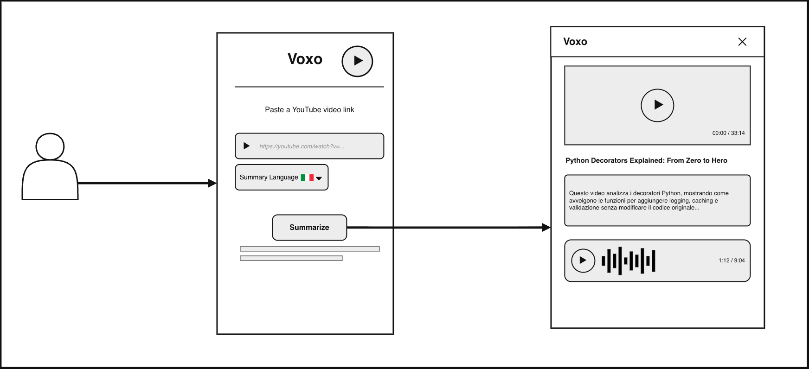
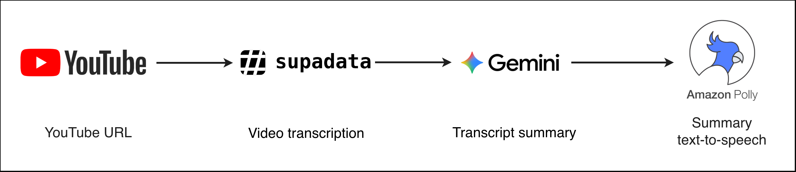
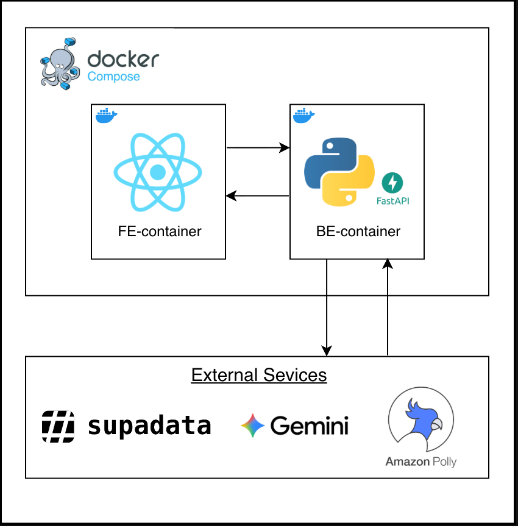
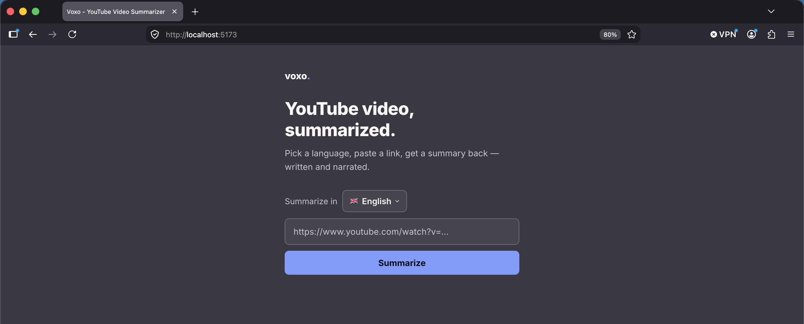
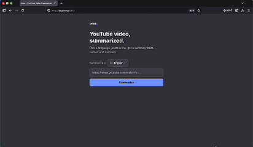

# Voxo

## Introduction

**Voxo** is a web app that uses artificial intelligence to turn any YouTube video into a written summary and narrated audio, in whichever language you choose. Built with modern technologies, it delivers a fast, focused experience centered on multilingual AI-powered video summarization.

## Description

**Voxo** changes the way you catch up on YouTube content using AI:

- **Instant Summaries**: Paste a link and get a written summary back in seconds
- **Narrated Audio**: Every summary is also read back to you as natural-sounding speech
- **Language Choice**: Pick from 15 languages — the summary and audio always match what you pick, never the video's own language
- **No Sign-Up**: Paste a link and go — no accounts, no saved video library

Designed for anyone with a long "Watch Later" list and not enough time to sit through it, Voxo makes catching up on video content faster and more flexible.

<div align="center">
  
</div>

### Technologies Used

#### Backend

- **[FastAPI](https://fastapi.tiangolo.com/)**: Python web framework serving the summarization pipeline
- **[Google Gemini](https://ai.google.dev/)**: AI model that generates the summary in the chosen language
- **[Amazon Polly](https://aws.amazon.com/polly/)**: Neural text-to-speech engine that narrates the summary
- **[Supadata.ai](https://supadata.ai/)**: Retrieves the YouTube video transcript

#### Frontend

- **[React](https://react.dev/)**: JavaScript library for the user interface
- **[Vite](https://vitejs.dev/)**: Build tool and development server

<div align="center">
  
</div>

## Getting started

```bash
# Clone the repository
git clone https://github.com/DarcoMondo/Website-Voxo.git
cd Website-Voxo

# Configure environment variables
cp .env.example .env
# Fill in GEMINI_API_KEY, SUPADATA_API_KEY, AWS_ACCESS_KEY_ID, AWS_SECRET_ACCESS_KEY, AWS_REGION

# Start both services with Docker Compose
docker compose up --build

# Frontend: http://localhost:5173
# Backend API: http://localhost:8000
```

<div align="center">
  
</div>

## Result
<div align="center">
<table>
  <tr>
    <td></td>
    <td></td>
  </tr>
</table>
</div>
